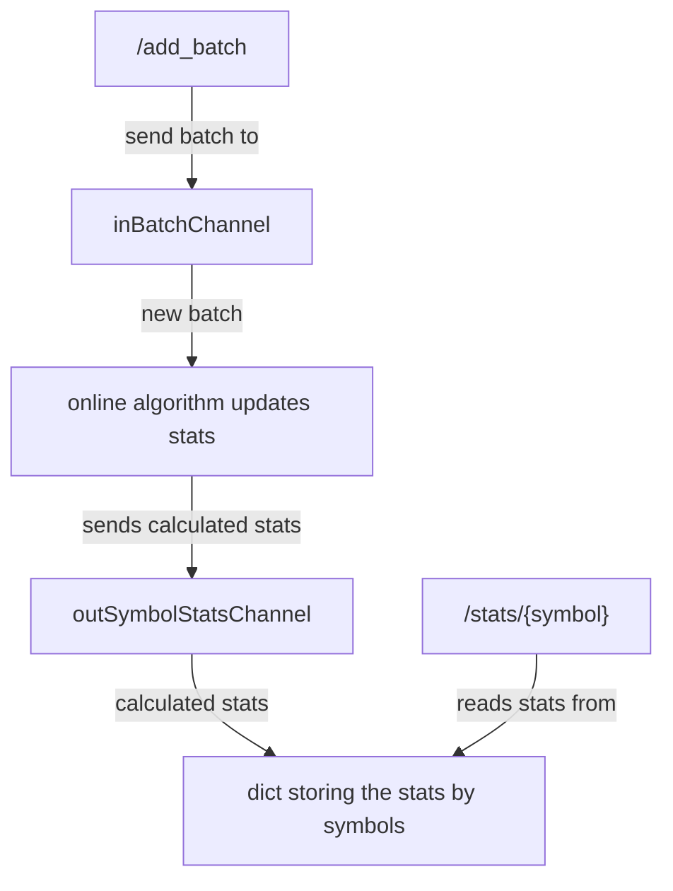

# Go Trading API

This repo implements a sample RESTful service for high frequency trading systems.
The service acts as a component in a trading infrastructure, managing and analysing financial data in near real-time.

It provides two API endpoints:

- `POST /add_batch` - Add a new batch of values.
- `GET /stats/{symbol}?k={k}` - Compute stats for values with the given symbol and 1eK size window.

The service uses online algorithms so that the statistics are computed as they are received.
The `/stats` endpoint is therefore only serving precomputed stats.

The architecture is shown in the following diagram:



When a batch is sent to the `/add_batch`, it is passed to an async channel to be processed.
The `ProcessChannelMessages` function reads from the channel sequentially and processes each batch.
It maintains the state for each symbol and uses online algorithms to update it.
It then sends the updated stats through another channel to the `StatsHandler` which stores them in a dictionary.
When a user requests the stats using the `/stats` API, they are just read from the dictionary.

The motivation for the use of channels was to make the API endpoints computationally inexpensive and to handle concurrency (the updates are processed serially).

## Installation

1. **Clone the repository:**

    ```bash
    git clone https://github.com/matus-tomlein/go-trading.git
    cd go-trading
    ```

2. **Install Go dependencies:**
    Make sure you have Go installed (version 1.20 or later recommended).

    ```bash
    go mod tidy
    ```

## Usage

**Running the API:**

```bash
go run cmd/main.go
```

The API will run on `http://localhost:8080`.

## Testing

The `utils` module is covered with unit tests.
The easiet way to run these is through VS Code, which auto detects them (make sure to install the Go extension).

## TODO

There are a number of limitations and things that could be improved:

1. The messages are processed serially. There is room for parallelization across symbols and window sizes.
2. Test coverage is lacking in some places. Especially would be good to have API integration tests.
3. The `movingminmax` package takes a little while to initialize for the 1e8 window size (around 4s on my laptop), after that it is fast. Would need a deeper investigation to see if this could be optimized.
4. Missing Swagger API docs.
5. The API is currently not horizontally scalable. If we replaced the channels by Kafka streams (or any other message queue), this could be enabled.
6. The app does not close channels that it opens and clean up before closing.
7. CI and CD
